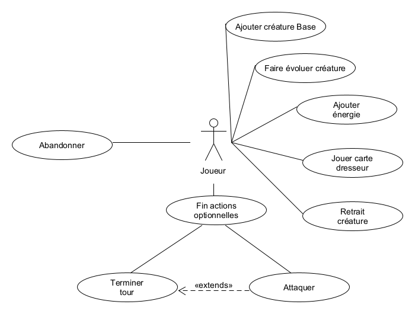

# Créature de combat - Expression des besoins

Table des matières:

1. [Objectif](#objectif)
1. [Présentation](#presentation)
    1. Présentation du projet
    1. Situation actuelle
    1. Les contraintes
1. [Les acteurs](#acteur)
    1. Administrateur
    1. Joueur
    1. Invité
1. [Cas d’utilisation](#usecase)
    1. Cas général
    1. Gestion Deck
    1. Gestion du jeu
    1. Jouer
1. [Annexe](#annexe)

---

## Objectif du document 

Ce document contient l'expression des besoins du projet "Créatures de Combat".  
Les besoins ont été exprimés selon le langage de modélisation UML. Les différentes catégories d'usagers du système ont été classés en différents types d' « acteurs ».  
Les interactions entre les usagers et le système ont été découpées en diagrammes de « cas d'utilisation » (use cases), chaque cas d'utilisation ayant à son tour un diagramme « d'activités » qui permet d'en modéliser la dynamique.

## Présentation 

### Présentation du projet

"Créatures de Combat" est un site de jeu où deux équipes de créatures s'affrontent en mode tour à tour.
L'équipe qui bat toutes les créatures de l'autre équipe remporte la victoire.

### Situation actuelle

Ce projet s'inspire des règles d'un célèbre jeu de plateau dont les principales règles devront être respectées.

### Les contraintes

Les règles du jeu devront être respectées

## Les Acteurs 

Il y aura trois types d'acteurs:

- l'administrateur
- le joueur
- l'anonyme (ou invité)

### Administrateur

L'administrateur pourra gérer les paramètres principaux du jeu.  
Ce profil est entièrement consacré à la gestion des cartes et de la gestion des comptes joueur.  
De ce fait, il ne sera pas possible de jouer en tant qu'administrateur. Ce compte permettra de:  

- Gérer les cartes
- Gérer les comptes joueurs

### Joueur

Le joueur pourra :

- gérer son deck de carte
- créer ou rejoindre une salle de combat

### Invité

Ce profil permet une connexion sur le site du jeu en mode anonyme.  
Il permettra de:

- Consulter les règles générales du jeu
- Créer un compte Joueur

## Cas d’utilisation 

### Cas général
Une fois le serveur de jeu lancé, il est possible de se connecter sur le serveur en tant qu'invité.
L'invité peut alors consulter les règles du jeu, il peut se logger mais aussi créer son compte joueur.
Une fois authentifié, le joueur pourra changer son mot de passe.
Il aura aussi la possibilité de gérer son deck, c'est à dire de pouvoir ajouter des cartes disponibles par la plateforme à son propre deck
Il peut aussi créer ou rejoindre une salle dans le but de jouer contre un autre joueur.

Le rôle d'administrateur permet de gérer certaines règles.
Il lui sera possible d'ajuster les règles de composition de carte d'un deck
Il pourra aussi créer de nouvelles cartes et les ajouter à la plateforme

Ci dessous, le diagramme de cas d'utilisation global.  
Certaines actions seront détaillé spécifiquement et accompagné d'un diagramme de cas d'utilisation plus précis.  
Ces actions sont:

- Gestion du jeu
- Gestion Deck
- Jouer

Ci dessous la description des différentes fonctionnalités

| **Nom de la fonctionnalité** | Acteur | Description |
|-|-|-|
| Consultation Règle du jeu | **Tous** | *Visualisation des règles du jeu* |
| Création Compte | **Invité** | *Création d'un compte Joueur avec définition d'un speudo. une fois le compte créé, l'utilisateur sera automatiquement authentifié* |
| Gestion Deck | **Joueur** | *Gestion du paquet de carte permettant de jouer* |
| Changement mot de passe | **Joueur** | *Suppression du compte utilisateur avec toutes les données associées* |
| Création Salle | **Joueur** | *Création d'une salle, il sera possible de jouer dès qu'un deuxième joueur aura rejoint la salle* |
| Rejoindre Salle | **Joueur** | *Rejoindre une salle créée par un autre joueur dans le but de l'affronter* |
| Jouer | **Joueur** | *Lancement d'une partie entre deux joueurs* |
| Authentification | **Joueur**, **Administrateur** | *permet de s'authentifier* |
| Gestion du jeu | **Administrateur** | *Gestion des règles du Deck / Création de carte* |

### Gestion Deck 

Description du cas test "Gestion Deck"

| **Nom de la fonctionnalité** | Description |
|-|-|
| Retirer Carte | *Retirer une carte de son deck* |
| Ajouter Carte | *Ajouter une carte à son deck* |
| Enregistrer | *Enregistrer le deck afin de pouvoir jouer avec* |

### Gestion du Jeu 

Description du cas test "Gestion du Jeu"

| **Nom de la fonctionnalité** | Description |
|-|-|
| Fixer Quota | *Permet de fixer une limite max et min de carte d'une certaine catégorie par deck* |
| Créer Carte | *Permet de créer une carte afin de l'ajouter dans la base de données du jeu. Pour cela, il sera possible d'ajouter une image, de définir sa description, son type mais aussi les caractéristiques techniques de la carte comme par exemple : points de vies, niveau d'attaque et de défense* |

### Jouer 

Elle représente les actions que le joueur peut effectuer à chaque tour

#### Cas Test

Description du cas test "Jouer"
Il s'agit de la principale fonctionnalité du jeu, elle sera donc plus détaillée que les autres cas tests.

| **Nom de la fonctionnalité** | Description |
|-|-|
| Ajouter créature base | *ajouter une créature de base à son banc si place disponible. si le banc est plein, il ne sera plus possible d'ajouter de créature de base au banc* |
| Faire évoluer créature | *il est possible de faire évoluer la créature active ou une créature de banc* |
| Ajouter énergie | *ajouter une carte énergie à une créature active ou de banc* |
| joueur carte dresseur | *il est possible de jouer plusieurs cartes objets mais seulement une seul carte supporteur* |
| retrait créature | *retrait de la créature active (le retrait à un coût d'énergie) au profil d'une créature présente sur le banc* |
| Attaquer | *Lancer une attaque de la créature active* |
| Terminer tour | *il est possible de terminer le tour sans attaquer* |
| Abandonner | *abandonner la partie et donner son adversaire gagnant* |

Il y a deux phases

- L'initialisation (préparation de la partie)
- L'étape d'un tour (déroulement d'un tour pour chaque joueur)

Lors de l'initialisation, il sera distribué à chaque joueur 7 cartes.
A ce stade, les cartes sont cachés de l'adversaire
Chaque joueur devra alors définir sa créature de base active, les autres pouvant être placées sur le banc
6 autres cartes seront placés dans le coin récompense.
Une fois "prêt", les cartes des créatures de banc et active se découvre et la partie peut commencer.

Pour l'étapde d'un tour, voir le diagramme d'activité ci dessous

#### Diagramme d'activité

Ci dessous le diagramme d'activité de l'algorithme des possibilités d'un joueur lors de son tour
Il y a quatre issues possibles :

- Fin de tour
- Le joueur perd
- Le joueur gagne
- Le joueur abandonne *(non réprésenté dans le diagramme)*

Lorsque c'est le tour d'un joueur, il reçoit automatiquement une nouvelle carte de son deck.
Comme le diagramme le montre, s'il n'est pas possible d'obtenir une nouvelle carte, le joueur à perdu.
Une fois sa nouvelle carte dans son jeu, il peut effectuer 6 actions dans l'ordre qu'il souhaite.
Il peut donc :

1. Mettre une créature de base sur le banc
1. Faire évoluer une créature
1. Ajouter une carte énergie à une créature
1. Utiliser plusieurs cartes "objet"
1. Utiliser une carte supporteur
1. remplacer sa créature active par une créature présente sur le banc

Il peut ensuite attaquer via sa créature active. s'il bat la créature active de son adversaire, il recevra une carte récompense.
Il obtiendra la victoire en cas de six récompenses obtenues
C'est alors à son adversaire de jouer

## Annexes 

### Terminologie

**Créature:** Il s'agit d'un personnage de type animal et fictif. La créature possède des caractéristiques d'attaque et de défense.

**Créature de base:** Il s'agit d'une créature au niveau zéro de l'évolution. Certaines créatures peuvent évoluer au niveau supérieur.

**Créature Active:** Il s'agit de la Créature principale. Elle sera la seule à pouvoir attaquer et à recevoir des dommages de  la créature adverse.

**Evolution:** Il s'agit d'une créature de niveau supérieure compatible uniquement avec une créature de base compatible.

**Banc:** Il s'agit d'une réserve de cinq places pouvant acceuillir des créatures de bases lors du combat.

**Carte objet:** Il s'agit d'une carte pouvant venir en aide aux créatures.

**Carte supporteur:** Il s'agit d'une carte pouvant aider le joueur.
