# Analyse

Table des matières:

- [1. Authentification](#1-authentification)
- [2. Création Salle](#2-création-salle)
- [3. Rejoindre Salle](#3-rejoindre-salle)
- [4. Gestion Deck](#4-gestion-deck)
  - [4.1 Chargement](#41-chargement-deck)
  - [4.2 Ajouter Carte](#42-ajouter-carte)
  - [4.3 Retirer Carte](#43-retirer-carte)
  - [4.4 Enregistrement](#44-enregistrement-deck)
- [5. Jouer](#5-jouer)
  - [5.1 Chargement](#51-chargement-plateau-jeu)
  - [5.1 Ajouter Créature Base](#52-ajouter-créature-de-base)
  - [5.1 Fin Actions Optionnelles](#53-fin-actions-optionnelles)
  - [5.1 Attaquer](#54-attaquer)

Pour les risques :

0. pas de problème
1. c'est plutot bien documenté
2. il faudra chercher l'information et expérimenter
3. c'est compliqué car difficile à mettre en place

Pour la pertinence :

0. c'est un nice to have
1. le système reste cohérent sans cette fonctionnalité
2. la majeure partie du système peut fonctionner
3. c'est obligatoire pour que ça fonctionne

| Cas | Risques | Pertinence | Prioritaire |
| -- | -- | -- | -- |
| Consultation Crédit| 0 | 0  | non |
| Jouer | 3 | 3 | oui  |
| Rejoindre Salle | 1 | 2 | oui |
| Créer Salle | 2 | 2 | oui |
| Changement mot de passe| 0 | 1 | non |
| Gestion Deck | 1 | 3 | oui |
| Authentification| 0 | 3 | oui |
| Créer un compte| 0 | 3 | oui|
| Gestion du jeu| 1 | 1 | non |

<div style="page-break-after: always"/>

## 1. Authentification

L'authentification sera géré par un mécanisme interne au framework

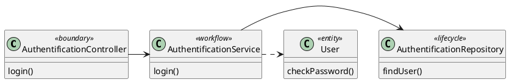

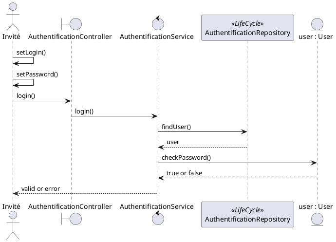

<div style="page-break-after: always"/>

## 2. Création Salle

La salle permet à deux joueurs de s'affronter

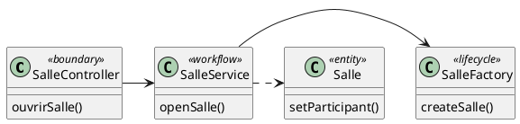

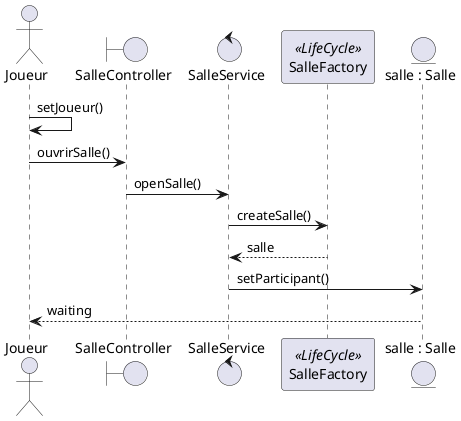

Un objet salle devra gérer les deux participants

<div style="page-break-after: always"/>

## 3. Rejoindre Salle

Pour rejoindre une salle, il est nécessaire qu'un 1er joueur ait créé la salle.
Il ne sera possible de jouer que lorsque deux joueurs seront présents

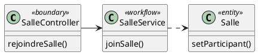

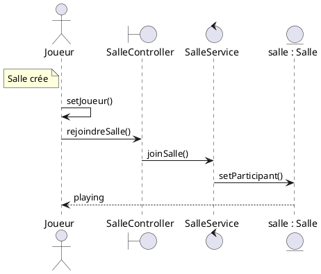

<div style="page-break-after: always"/>

## 4. Gestion Deck

### 4.1. Chargement Deck

Il n'est pas encore décidé si le joueur pourra avoir un ou plusieurs Deck associé à son nom ou bien si le joueur peut le choisir dans une liste de deck ouvert à tous.

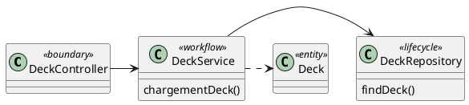

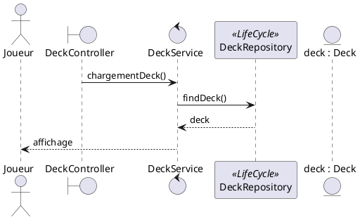

<div style="page-break-after: always"/>

### 4.2. Ajouter Carte

Le Deck doit être chargé au préalable

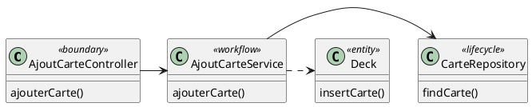

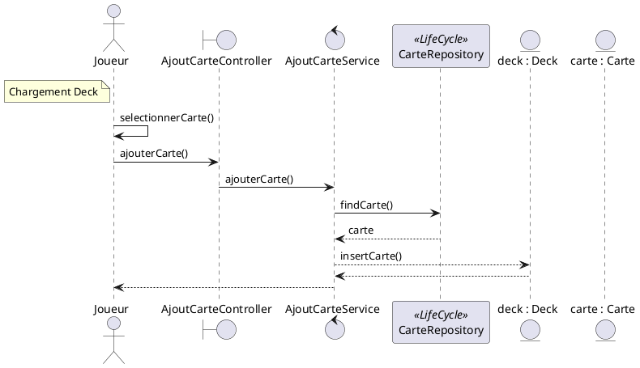

<div style="page-break-after: always"/>

### 4.3. Retirer Carte

Le Deck doit être chargé au préalable

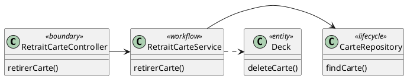

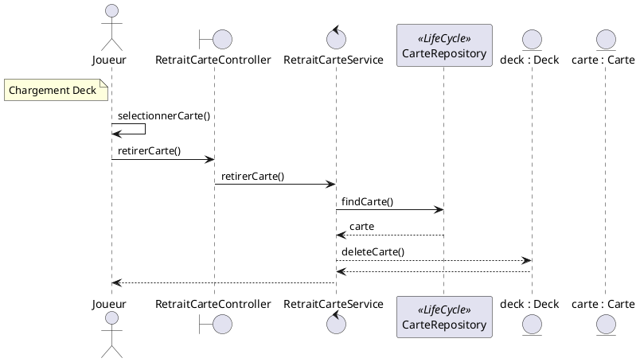

<div style="page-break-after: always"/>

### 4.4. Enregistrement Deck

Le Deck doit être chargé au préalable.

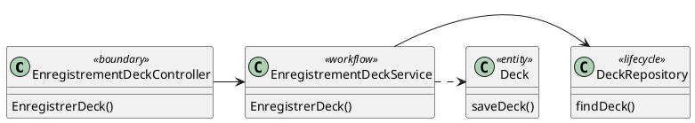

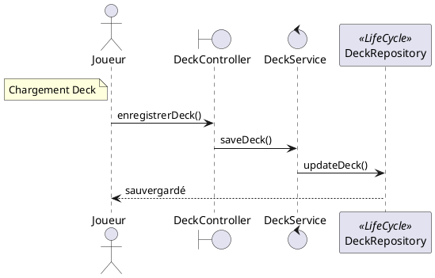

<div style="page-break-after: always"/>

## 5. Jouer

### 5.1. Chargement Plateau Jeu

Le chargement du plateau de jeu sera effectif suite à la création d'une salle par deux joueurs.

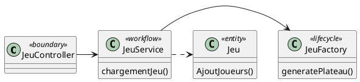

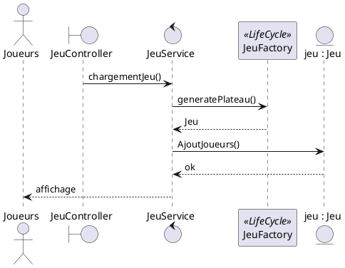

<div style="page-break-after: always"/>

### 5.2. Ajouter Créature de Base

Dans l'idée, ce diagramme est commun à l'ensemble des actions optionnelles, soit:

- Faire évoluer Créature
- Ajouter énergie
- Jouer carte dresseur

Le système cherchera la carte dans le deck puis exécutera la méthode du Jeu correspondant à l'action en cours.

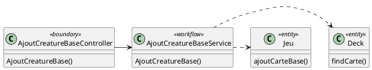

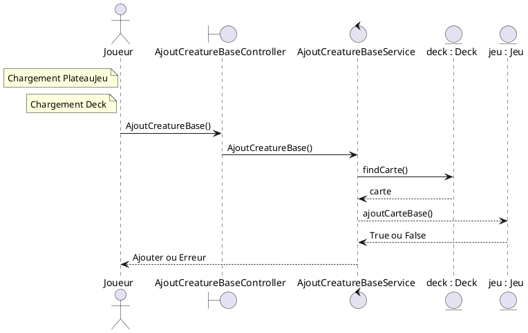

<div style="page-break-after: always"/>

### 5.3. Fin Actions Optionnelles

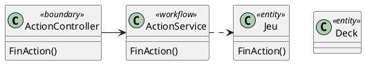

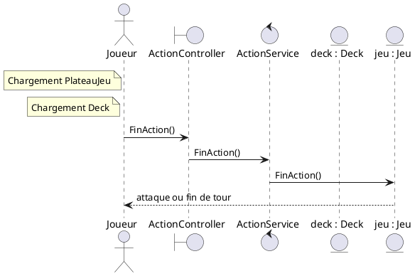

<div style="page-break-after: always"/>

### 5.4. Attaquer

```plantuml
@startuml
    class ActionController <<boundary>> {
        Attaque()
    }
    class ActionService <<workflow>> {
        Attaque()
    }
    class Jeu <<entity>> {
        Attaque()
    }

    ActionController -> ActionService
    ActionService .> Jeu

@enduml
```

```plantuml
@startuml
actor Joueur as a
boundary AttaqueController as rc
control AttaqueService as s
note left of a : Fin Actions Optionnelles
a -> rc: Attaque()
rc -> s: Attaque()
s -> jeu : Attaque()
jeu -> jeu: calculDegat()
jeu --> a: fin de tour
@enduml
```
