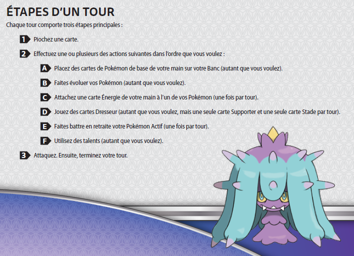
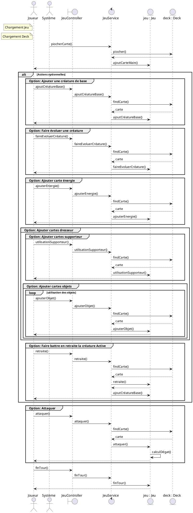
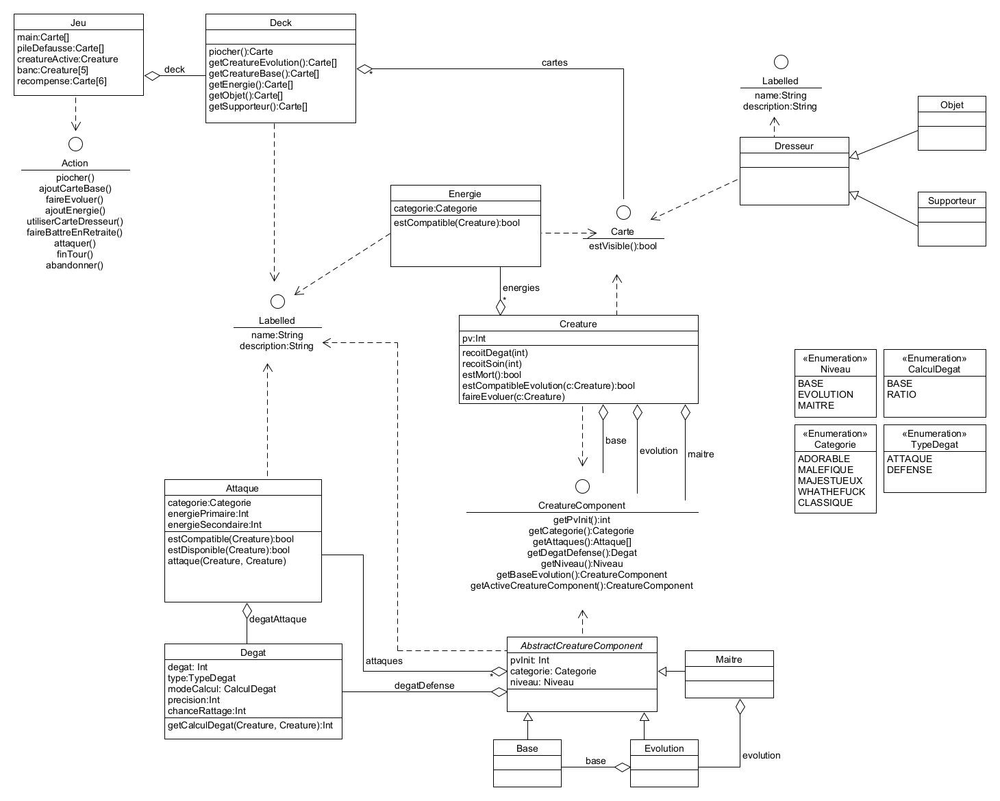

# Conception

Table des matières:

1. [Technologies utilisées](#1-technologies-utilisées)
1. [Usecase : Jouer](#2-cas-dutilisation-général--déroulement-un-tour)
    1. [Règle en vigueur](#21-réalisation-dun-tour-selon-les-règles-en-vigueur)
    1. [Diagramme de séquence d'un tour](#22-diagramme-de-séquence-dun-tour)
1. [Diagramme de classe](#3-diagramme-de-classe-du-métier)

<div class="page"/>

## 1. Technologies utilisées

Ce projet sera développé en Java17 LTS qui est la dernière version Java avec support long terme disponible.

L'architecture sera celle de Spring / Spring Boot avec utilisation des ```RestController```

L'utilisation de JPA a été préférée pour la persistance des données.

Thymeleaf sera la technologie utilisée pour le front avec l'ajout de bibliothèques additionnelles comme JQuery ou bien Bootstrap.

Le modèle métier étant la plus grosse partie du projet, l'utilisation de EMF (Eclipse Modelling Framework) sera un gros plus grâce notamment à la génération automatique des classes.

L'objectif de ce projet est d'avoir une approche DDD (Domain Driven Design) afin d'avoir un back qui pilote le front pour la partie déroulement d'un tour.
L'implémentation de ce système passera par du CRUD niveau 3 HATEOAS  
De ce fait, l'objectif du front sera d'afficher ou non certaines actions en fonction de la présence de lien venant du back.

<div class="page"/>

## 2. Cas d'utilisation général : déroulement un tour

### 2.1 Réalisation d'un tour selon les règles en vigueur



A noté que dans cette version il n'y a pas de talent.

L'étape ```F``` ne sera donc pas représentée

<div class="page"/>

### 2.2 Diagramme de séquence d'un tour

Ce usecase représente la réalisation d'un tour pour un joueur



<div class="page"/>

## 3. Diagramme de classe du métier

Le diagramme de classe du métier sera donc :



Le système d'évolution sera managé par trois classes : ```Base```, ```Evolution``` et ```Maitre```

L'interface commune à ces évolutions sera du type ```CreatureComponent```

L'interface ```Carte``` pourra cacher des implémentations de type ```Creature```, ```Energie``` ou bien ```Dresseur``` soit trois types de cartes différentes.

Les actions possibles d'un joueur seront présentes via l'interface ```Action```
